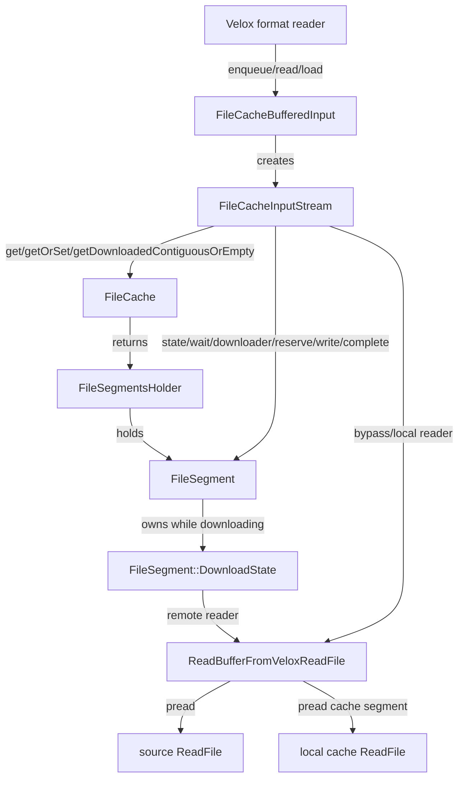
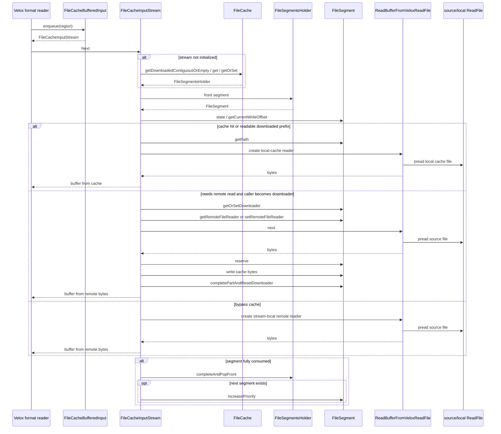

# `FileCacheBufferedInput` 集成设计

`FileCacheBufferedInput` 是把 ClickHouse `FileCache` 接入 Velox scan / DWIO
读路径的主方案。它不是 `AsyncDataCache` 的替代实现，也不应该继承
`CachedBufferedInput`；它应该直接继承 `BufferedInput`，并把 ClickHouse
`CachedOnDiskReadBufferFromFile` 的 reader 状态机迁移到
`FileCacheInputStream`。

## 为什么选 `BufferedInput` 层

Velox scan 读链路是：

```text
Format reader
  -> BufferedInput
      -> SeekableInputStream
          -> ReadFileInputStream
              -> ReadFile
```

ClickHouse 的 `CachedOnDiskReadBufferFromFile` 是 stateful streaming reader：

```text
nextImpl
  -> 当前 offset
  -> 当前 FileSegment
  -> 当前 ReadType
  -> 当前 buffer
  -> downloader 状态
```

这个模型更接近 Velox 的：

```text
BufferedInput::read / enqueue / load
  -> SeekableInputStream::Next
```

而不是 Velox `ReadFile::pread`。`ReadFile` 是无状态 positioned read 接口，
每次调用都只看 `offset + length + output`，看不到 scan 层已经计划的 regions、
prefetch、preload、stream window、`Next` 生命周期。

所以主读路径应该是：

```text
FileCacheBufferedInput : BufferedInput
FileCacheInputStream   : SeekableInputStream
```

## 和现有 Velox 类的关系

现有 Velox 类职责：

```text
BufferedInput
  管 enqueue/load/read/preload 这套 scan reader 接口

CachedBufferedInput
  用 AsyncDataCache / SsdCache 做 Velox 现有 raw bytes cache

CacheInputStream
  用 CachePin 从 AsyncDataCache 读数据

ReadFileInputStream
  把 ReadFile 适配成 InputStream
```

新的 ClickHouse `FileCache` 路径应该是：

```text
FileCacheBufferedInput
  管 scan reader 接口和 FileCache region 规划

FileCacheInputStream
  管单个 region 的 streaming 读取状态机

FileCache
  管 segment、metadata、reserve、eviction、query limit

inner ReadFile / ReadFileInputStream
  真正读取远端/本地源文件
```

不要在同一路径上同时使用 `CachedBufferedInput` 和 `FileCacheBufferedInput` 缓存同一份
raw bytes，否则会变成：

```text
remote -> FileCache 本地 segment -> AsyncDataCache memory entry
```

## 类结构

### `FileCacheBufferedInput`

```cpp
class FileCacheBufferedInput : public BufferedInput
{
public:
    FileCacheBufferedInput(
        std::shared_ptr<ReadFile> readFile,
        FileCachePtr cache,
        FileCacheKey cacheKey,
        FileCacheOriginInfo origin,
        FileCacheReadOptions cacheOptions,
        const MetricsLogPtr & metricsLog,
        std::shared_ptr<IoStatistics> ioStatistics,
        std::shared_ptr<velox::IoStats> ioStats,
        folly::Executor * executor,
        const io::ReaderOptions & readerOptions,
        folly::F14FastMap<std::string, std::string> fileReadOps = {});

    std::unique_ptr<SeekableInputStream> enqueue(
        velox::common::Region region,
        const StreamIdentifier * sid = nullptr) override;

    void load(LogType logType) override;

    std::unique_ptr<SeekableInputStream>
    read(uint64_t offset, uint64_t length, LogType logType) const override;

    bool isBuffered(uint64_t offset, uint64_t length) const override;

    bool shouldPreload(int32_t numPages = 0) override;
    bool shouldPrefetchStripes() const override;
    std::unique_ptr<BufferedInput> clone() const override;

    bool hasCache() const override { return true; }

    FileCache & fileCache() const { return *cache_; }
    const std::shared_ptr<ReadFile> & sourceReadFile() const { return sourceReadFile_; }
    const FileCacheKey & cacheKey() const { return cacheKey_; }
    const FileCacheOriginInfo & origin() const { return origin_; }
    const FileCacheReadOptions & cacheOptions() const { return cacheOptions_; }
    uint64_t fileSize() const { return fileSize_; }

private:
    struct Request
    {
        velox::common::Region region;
        const StreamIdentifier * sid = nullptr;
        FileCacheInputStream * stream = nullptr;
    };

    FileCacheRequestContext makeCacheContext(const FileIoContext & context) const;

    std::shared_ptr<ReadFile> sourceReadFile_;
    FileCachePtr cache_;
    FileCacheKey cacheKey_;
    FileCacheOriginInfo origin_;
    FileCacheReadOptions cacheOptions_;
    std::shared_ptr<IoStatistics> ioStatistics_;
    std::shared_ptr<velox::IoStats> ioStats_;
    folly::Executor * executor_;
    io::ReaderOptions readerOptions_;
    uint64_t fileSize_;
    std::vector<Request> requests_;
};
```

`FileCacheBufferedInput` 的职责：

- 在 `enqueue` 里创建 `FileCacheInputStream`；
- 在 `load` 里处理已经 enqueue 的 regions；
- 在 `read` 里支持未计划的读取；
- 在 `isBuffered` 里复用 ClickHouse `isContentCached` 的判断思路；
- 提供构造 `FileCacheRequestContext` 的统一入口。
- 暴露 `FileCacheInputStream` 需要的不可变上下文，例如 `FileCache`、cache key、
  origin、settings、file size 和 source `ReadFile`。

第一版 `load` 可以只做轻量 prepare，不强制预下载远端数据。后续再考虑基于
`executor_` 做异步预下载。

### `FileCacheInputStream`

```cpp
class FileCacheInputStream : public SeekableInputStream
{
public:
    FileCacheInputStream(
        FileCacheBufferedInput * owner,
        velox::common::Region region,
        FileCacheRequestContext cacheContext,
        LogType logType);

    ~FileCacheInputStream() override;

    bool Next(const void ** data, int * size) override;
    void BackUp(int count) override;
    bool SkipInt64(int64_t count) override;
    int64_t ByteCount() const override;
    void seekToPosition(PositionProvider & position) override;
    std::string getName() const override;
    size_t positionSize() const override;

private:
    struct ReadInfo
    {
        FileSegmentsHolderPtr fileSegments;
        std::shared_ptr<ReadBufferFromVeloxReadFile> remoteReader;
        std::shared_ptr<ReadBufferFromVeloxReadFile> cacheReader;
        uint64_t readUntilPosition = 0;

        void reset();
    };

    enum class ReadType : uint8_t
    {
        CACHED,
        REMOTE_FS_READ_BYPASS_CACHE,
        REMOTE_FS_READ_AND_PUT_IN_CACHE,
        NONE,
    };

    struct ReadFromFileSegmentState
    {
        std::shared_ptr<ReadBufferFromVeloxReadFile> reader;
        ReadType readType = ReadType::NONE;
        uint64_t bytesToPredownload = 0;
        BufferPtr predownloadBuffer;
    };

    void initializeIfNeeded();
    bool nextFileSegmentsBatch();

    std::unique_ptr<ReadFromFileSegmentState> prepareReadFromFileSegmentState(
        FileSegment & fileSegment,
        uint64_t offset);

    std::unique_ptr<ReadFromFileSegmentState> createReadFromFileSegmentState(
        FileSegment & fileSegment,
        uint64_t offset);

    std::shared_ptr<ReadBufferFromVeloxReadFile> getCacheReadBuffer(
        const FileSegment & fileSegment);

    std::shared_ptr<ReadBufferFromVeloxReadFile> getRemoteReadBuffer(
        FileSegment & fileSegment,
        uint64_t offset,
        ReadType readType);

    bool canStartFromCache(uint64_t offset, const FileSegment & fileSegment) const;
    void updateReadStateIfNeeded(FileSegment & fileSegment, uint64_t offset);

    size_t readFromCurrentSegment();
    bool predownloadForCurrentSegment(FileSegment & fileSegment);
    bool writeCache(char * data, size_t size, uint64_t offset, FileSegment & fileSegment);
    void completeCurrentSegmentAndAdvance();
    void releaseDownloaderIfNeeded();

    FileCacheBufferedInput * owner_;
    velox::common::Region region_;
    FileCacheRequestContext cacheContext_;
    FileCache::QueryContextHolderPtr queryContextHolder_;
    LogType logType_;

    uint64_t position_ = 0;
    BufferPtr outputBuffer_;
    size_t offsetInOutputBuffer_ = 0;
    size_t outputBufferSize_ = 0;

    ReadInfo readInfo_;
    std::unique_ptr<ReadFromFileSegmentState> state_;
    bool initialized_ = false;
};
```

`FileCacheInputStream::Next` 对应 ClickHouse
`CachedOnDiskReadBufferFromFile::nextImplStep`。

## `enqueue` / `load` / `read` 的语义

### `enqueue`

`enqueue(region)` 创建一个 `FileCacheInputStream`，并记录 request：

```text
FileCacheBufferedInput::enqueue(region)
  -> stream = FileCacheInputStream(region)
  -> requests_.push_back({region, sid, stream.get()})
  -> return stream
```

这里不要创建 `AsyncDataCache` entry，也不要分配 `CachePin`。

### `load`

Velox 调用 `load` 表示之前 enqueue 的 regions 可以被预处理。

第一版建议：

```text
load()
  -> 对每个 request 调 stream->initializeIfNeeded()
  -> 只获取 FileSegmentsHolder / prepare metadata
  -> 不主动远端下载
```

这样能先保持 ClickHouse 的按需 downloader 语义。后续可以扩展：

```text
load(prefetch)
  -> 用 executor 触发预下载
  -> 但仍然必须走 getOrSetDownloader / reserve / writeCache
```

### `read`

未计划读取时，仍然返回 `FileCacheInputStream`：

```text
read(offset, length)
  -> return FileCacheInputStream(region={offset, length})
```

不要回退到裸 `SeekableFileInputStream`，否则这条路径会绕过 `FileCache`。

## `FileCacheInputStream` 的状态机

`FileCacheInputStream` 内部保留 ClickHouse 这几组状态：

```text
ReadInfo
ReadType
ReadFromFileSegmentState
FileSegmentsHolder
```

其中 `ReadType` 必须保留三态：

```text
CACHED
REMOTE_FS_READ_BYPASS_CACHE
REMOTE_FS_READ_AND_PUT_IN_CACHE
```

`initializeIfNeeded` 对应 ClickHouse `initialize` / `nextFileSegmentsBatch`：

```text
if temp_cache_only:
    cache->getDownloadedContiguousOrEmpty
else if read_if_exists_otherwise_bypass:
    cache->get
else:
    cache->getOrSet
```

`prepareCurrentSegment` 对应 ClickHouse `prepareReadFromFileSegmentState` /
`createReadFromFileSegmentState`：

```text
根据 FileSegment::state 选择 ReadType
必要时 wait
必要时 getOrSetDownloader
必要时计算 bytes_to_predownload
```

`readFromCurrentSegment` 对应 ClickHouse `readFromFileSegment`：

```text
如果需要 predownload:
    predownloadForCurrentSegment

reader.next / local cache read

如果 REMOTE_FS_READ_AND_PUT_IN_CACHE:
    file_segment.reserve
    file_segment.write
    失败则切 REMOTE_FS_READ_BYPASS_CACHE

把可返回字节放到 outputBuffer_
```

`completeCurrentSegmentAndAdvance` 对应 ClickHouse
`completeFileSegmentAndGetNext`：

```text
fileSegments->completeAndPopFront(...)
如果还有下一个 segment:
    increasePriority
    prepareCurrentSegment
```

## 和 `FileCache` 对象的交互

`FileCache` 自身的接口和实现不重新设计，迁移时直接参考 ClickHouse。这里设计的是
`FileCacheBufferedInput` / `FileCacheInputStream` 在哪些点调用它。

### `FileCacheBufferedInput`

`FileCacheBufferedInput` 不直接操作 segment 状态机。它主要负责保存不可变上下文，
并创建 `FileCacheInputStream`：

| 位置 | `FileCache` 交互 |
|---|---|
| 构造函数 | 保存 `FileCachePtr`、`FileCacheKey`、`FileCacheOriginInfo`、`FileCacheReadOptions` |
| `enqueue` | 创建 `FileCacheInputStream`；不调用 `FileCache::getOrSet`，避免 enqueue 阶段提前改变 cache 状态 |
| `load` | 第一版只调用各 stream 的 `initializeIfNeeded`；是否触发实际预下载留到后续 |
| `read` | 对未计划读取创建新的 `FileCacheInputStream`，仍然走同一套 `FileCache` 状态机 |
| `isBuffered` | 可选：创建只读探测上下文，复用 `FileCacheInputStream::isRangeCached` 或 ClickHouse `isContentCached` 规则 |

### `FileCacheInputStream`

`FileCacheInputStream` 是主要交互点，对应 ClickHouse
`CachedOnDiskReadBufferFromFile`。

| 函数 | `FileCache` / `FileSegment` 交互 |
|---|---|
| 构造函数或 `initializeIfNeeded` | 调 `owner_->fileCache().getQueryContextHolder`，保持 query cache limit 上下文 |
| `nextFileSegmentsBatch` | 按设置调用 `getDownloadedContiguousOrEmpty` / `get` / `getOrSet` |
| `createReadFromFileSegmentState` | 根据 `FileSegment::state` 选择 `ReadType`；必要时调用 `wait`、`getOrSetDownloader`、`resetDownloader` |
| `getCacheReadBuffer` | 通过 `fileSegment.getPath` 打开本地 cache segment 文件，构造 `ReadBufferFromVeloxReadFile` |
| `getRemoteReadBuffer` | `REMOTE_FS_READ_AND_PUT_IN_CACHE` 时通过 `fileSegment.getRemoteFileReader` / `setRemoteFileReader` 复用 remote reader；bypass 时使用 stream 局部 reader |
| `predownloadForCurrentSegment` | 调 `fileSegment.reserve`，成功后调 `writeCache`，失败时 `completePartAndResetDownloader` 并切 bypass |
| `readFromCurrentSegment` | 读本地 cache 或远端；远端写 cache 时调用 `reserve` + `writeCache` |
| `writeCache` | 调 `fileSegment.write`，按 `skip_cache_on_disk_failure` 决定失败时 bypass 还是抛错 |
| `completeCurrentSegmentAndAdvance` | 调 `readInfo_.fileSegments->completeAndPopFront`，然后对下一个 segment 调 `increasePriority` |
| 析构函数 | 如果仍持有未完成 segment 或 downloader，调用 `completePartAndResetDownloader` / `completeAndPopFront` 释放状态 |

### `ReadBufferFromVeloxReadFile`

`ReadBufferFromVeloxReadFile` 不直接调用 `FileCache`。它只负责把 Velox `ReadFile`
包装成 ClickHouse 风格的 buffer：

```text
FileCacheInputStream
  -> ReadBufferFromVeloxReadFile::next
      -> ReadFile::pread
```

它和 `FileCache` 的关系只有两种：

- 作为 remote reader，被 `FileSegment::DownloadState` 持有；
- 作为 local cache reader，被当前 `FileCacheInputStream::ReadInfo` 持有。

## 从 `CachedOnDiskReadBufferFromFile` 提取的实现

实现时不应该重新设计 `FileCache` 对象；`FileCache`、`FileSegment`、
`FileSegmentsHolder`、priority、metadata 的接口和实现直接参考 ClickHouse。
需要从 `CachedOnDiskReadBufferFromFile` 提取的是 reader 层状态机，也就是
`CachedOnDiskReadBufferFromFile` 如何驱动 `FileCache` 的那部分。

### 直接提取到 `FileCacheInputStream`

这些函数对应 `FileCacheInputStream` 的核心实现，应该尽量按原逻辑迁移，只替换类型、
日志、异常、metrics、底层 reader。

| ClickHouse 函数 | Velox 目标函数 | 调用方 |
|---|---|---|
| `nextFileSegmentsBatch` | `FileCacheInputStream::nextFileSegmentsBatch` | `initializeIfNeeded`；当前 batch 读完后也会再次调用 |
| `initialize` | `FileCacheInputStream::initializeIfNeeded` | `Next` 第一次读取时调用；`load` 可以提前调用 |
| `createReadFromFileSegmentState` | `FileCacheInputStream::createReadFromFileSegmentState` | `prepareReadFromFileSegmentState` |
| `prepareReadFromFileSegmentState` | `FileCacheInputStream::prepareReadFromFileSegmentState` | `Next` 首次读当前 segment；`updateReadStateIfNeeded`；切换下一个 segment 后 |
| `canStartFromCache` | `FileCacheInputStream::canStartFromCache` | `createReadFromFileSegmentState` |
| `predownloadForFileSegment` | `FileCacheInputStream::predownloadForCurrentSegment` | `readFromCurrentSegment` 在 `bytesToPredownload > 0` 时调用 |
| `readFromFileSegment` | `FileCacheInputStream::readFromCurrentSegment` | `Next` 主循环 |
| `writeCache` | `FileCacheInputStream::writeCache` | `predownloadForCurrentSegment`；`readFromCurrentSegment` |
| `updateReadStateIfNeeded` | `FileCacheInputStream::updateReadStateIfNeeded` | `Next` 继续读取同一 segment 前；`readBigAt` 形态循环里 |
| `updateImplementationBufferIfNeeded` | `FileCacheInputStream::updateCurrentReaderIfNeeded` | `Next` 中，如果已有 `state_`，读前先检查是否需要切 segment 或重建 state |
| `completeFileSegmentAndGetNext` | `FileCacheInputStream::completeCurrentSegmentAndAdvance` | 当前 offset 超过 segment 右边界时；`readFromCurrentSegment` 后也可能触发 |
| `nextImplStep` | `FileCacheInputStream::Next` 的主体 | Velox format reader 调 `Next` |
| 析构函数 `~CachedOnDiskReadBufferFromFile` | `FileCacheInputStream::~FileCacheInputStream` | stream 生命周期结束时释放 downloader / holder |
| `getRemainingSizeToRead` | `FileCacheInputStream::remainingInRegion` | `nextFileSegmentsBatch` |
| `getInfoForLog` | `FileCacheInputStream::debugInfo` | 异常补充信息和日志 |
| `toString(ReadType)` | `toString(ReadType)` helper | 日志和错误消息 |

### 提取成 reader helper

这些函数不是 `FileCacheInputStream` 状态机本身，而是构造当前 `ReadType` 使用的 reader。

| ClickHouse 函数 | Velox 目标函数 | 调用方 |
|---|---|---|
| `getCacheReadBuffer` | `FileCacheInputStream::getCacheReadBuffer` | `createReadFromFileSegmentState` 在 `ReadType::CACHED` 时调用 |
| `getRemoteReadBuffer` | `FileCacheInputStream::getRemoteReadBuffer` | `createReadFromFileSegmentState` 在 `REMOTE_FS_READ_*` 时调用；`predownload` 失败切 bypass 时也会调用 |

Velox 里的 `getCacheReadBuffer` 创建 `ReadBufferFromVeloxReadFile`，其底层 `ReadFile`
必须来自本地 cache 文件，不能再经过 `FileCacheBufferedInput`。

Velox 里的 `getRemoteReadBuffer` 也创建 `ReadBufferFromVeloxReadFile`，但底层
`ReadFile` 是 source `ReadFile`：

```text
REMOTE_FS_READ_AND_PUT_IN_CACHE:
    优先复用 fileSegment.getRemoteFileReader
    没有则创建 reader 并 fileSegment.setRemoteFileReader

REMOTE_FS_READ_BYPASS_CACHE:
    优先复用当前 ReadInfo::remoteReader
    也可从 fileSegment.extractRemoteFileReader 拿可复用 reader
    但不挂回 FileSegment
```

### 作为 `BufferedInput` / `SeekableInputStream` 适配的方法

这些函数不需要逐字迁移，但语义要映射到 Velox 对应接口。

| ClickHouse 函数 | Velox 目标函数 | 调用方 |
|---|---|---|
| `nextImpl` | `FileCacheInputStream::Next` 外层 try/catch 包装 | Velox format reader |
| `seek` | `FileCacheInputStream::seekToPosition` | ORC/DWRF position provider |
| `getPosition` | `FileCacheInputStream::ByteCount` / 内部 `position_` | Velox stream API |
| `setReadUntilPosition` / `setReadUntilEnd` | `FileCacheInputStream` 的 region/window 初始化，不作为 public API 暴露 | `FileCacheBufferedInput::read/enqueue` 创建 stream 时 |
| `readBigAt` | 不直接迁移；其 positioned-read 结构用于指导 `FileCacheInputStream` 的局部 `ReadInfo` 设计 | 如果未来实现 `CachedReadFile` 兜底，可参考它 |
| `isContentCached` | `FileCacheBufferedInput::isBuffered` 或 `FileCacheInputStream::isRangeCached` | Velox reader 查询是否已 buffered |
| `isSeekCheap` | 可选；如果 Velox 调用点需要，再映射到内部 helper | 暂不作为第一版必需接口 |
| `appendFilesystemCacheLog` | 可选迁移为 Velox stats/log hook | `completeCurrentSegmentAndAdvance` / 析构 |

### 不需要迁移的部分

| ClickHouse 函数/字段 | 原因 |
|---|---|
| `getMetadata` | 这是 `IReadBufferMetadataProvider` 相关逻辑；Velox `BufferedInput` 设计第一版不需要 |
| `tryGetFileSize` / `getFileSize` 的外部接口 | Velox `ReadFile::size` 已提供文件大小；内部可直接用 `owner_->fileSize` |
| `ReadBufferFromFileBase` 继承体系 | 不迁移完整 IO 框架，只用 `ReadBufferFromVeloxReadFile` 覆盖本路径需要的能力 |
| `CurrentMetrics::Increment` | 替换成 Velox stats/metrics，或第一版先用 `FileCacheStats` |

### 调用关系

`FileCacheInputStream::Next` 的主调用关系应该对应 ClickHouse `nextImplStep`：

```text
Next
  -> initializeIfNeeded
       -> nextFileSegmentsBatch
            -> FileCache::getDownloadedContiguousOrEmpty / get / getOrSet
  -> updateCurrentReaderIfNeeded
       -> completeCurrentSegmentAndAdvance
       -> updateReadStateIfNeeded
            -> prepareReadFromFileSegmentState
                 -> createReadFromFileSegmentState
                      -> canStartFromCache
                      -> getCacheReadBuffer / getRemoteReadBuffer
                      -> FileSegment::wait / getOrSetDownloader / resetDownloader
  -> readFromCurrentSegment
       -> predownloadForCurrentSegment
            -> FileSegment::reserve
            -> writeCache
                 -> FileSegment::write
       -> reader->next
       -> FileSegment::reserve
       -> writeCache
  -> releaseDownloaderIfNeeded
       -> FileSegment::completePartAndResetDownloader
  -> completeCurrentSegmentAndAdvance
       -> FileSegmentsHolder::completeAndPopFront
       -> FileSegment::increasePriority
```

`FileCacheBufferedInput` 的调用关系更薄：

```text
enqueue(region)
  -> new FileCacheInputStream(...)
  -> remember Request

load(logType)
  -> for request in requests:
         request.stream->initializeIfNeeded()

read(offset, length)
  -> new FileCacheInputStream(...)

isBuffered(offset, length)
  -> optional read-only probe based on FileCacheInputStream::isRangeCached
```

## 交互图

### 组件关系



### 一次 `Next` 读请求



## Buffer adapters

`FileCacheInputStream` 依赖两个 CH-style buffer adapter：

```text
ReadBufferFromVeloxReadFile
WriteBufferFromVeloxWriteFile
```

它们的接口和 Velox `BufferPtr` 使用约定见
[`04-filecache-infra-mapping.md`](04-filecache-infra-mapping.md)。

## `BackUp` / `SkipInt64` / `seekToPosition`

`FileCacheInputStream` 是 `SeekableInputStream`，需要处理流式消费语义。

### `BackUp`

只允许回退当前 `outputBuffer_` 内已经返回但还没被上层永久消费的字节：

```text
BackUp(count)
  -> count <= offsetInOutputBuffer_
  -> position_ -= count
  -> offsetInOutputBuffer_ -= count
```

不要因为 `BackUp` 重置 `FileCache` 状态。

### `SkipInt64`

`SkipInt64(count)` 应该推进 region 内 position：

```text
如果当前 outputBuffer_ 还有足够字节:
    只移动 offsetInOutputBuffer_
否则:
    消耗当前 buffer
    继续调用 Next 丢弃数据，直到 skip 完成或到 region 末尾
```

### `seekToPosition`

Velox 的 `seekToPosition` 用于 reader 内部 position provider。它应该重置当前
stream 的局部状态：

```text
position_ = newPosition
readInfo_.reset()
state_.reset()
initialized_ = false
```

这对应 ClickHouse `CachedOnDiskReadBufferFromFile::seek` 的“reset state for seek”
行为。

## 与 `CachedBufferedInput` / `AsyncDataCache` 的关系

`FileCacheBufferedInput` 不应该继承 `CachedBufferedInput`，因为：

- `CachedBufferedInput` 的核心是 `AsyncDataCache` / `CachePin`；
- ClickHouse `FileCache` 的核心是 `FileSegment` / `reserve` / `eviction`;
- 两者同时启用会双重缓存 raw bytes。

如果某条 scan 路径启用 `FileCacheBufferedInput`，这条路径应该不再使用
`CachedBufferedInput` 的 raw bytes retention。

可以保留 Velox 的 region planning 思路，但缓存对象必须是 `FileSegment`，不是
`CachePin`。

## 和 `CacheFileSystem` 的关系

`FileCacheBufferedInput` 是主 scan 读路径。

`CacheFileSystem` / `CachedReadFile` 如果以后需要，可以作为非 DWIO/scan 的兜底：

```text
工具代码 / 非 BufferedInput 调用 ReadFile
  -> CachedReadFile
```

但第一阶段可以不实现 `CachedReadFile`。先把 ClickHouse
`CachedOnDiskReadBufferFromFile` 的状态机迁到 `FileCacheInputStream`，更贴近真实语义。

## 最小落地步骤

1. 添加 `FileCacheBufferedInput` / `FileCacheInputStream` 空壳，先委托底层
   `ReadFile` 直接读取，保证 Velox reader 接口可接入。
2. 加入 `FileCacheReadInfo`、`ReadType`、`ReadFromFileSegmentState`。
3. 加入 `ReadBufferFromVeloxReadFile`，构造时接收 Velox `ReadFile`，内部自带缓冲区。
4. 用同一个 `ReadBufferFromVeloxReadFile` 支持远端源文件和本地 cache segment 文件。
5. 实现 `initializeIfNeeded`：接 `getDownloadedContiguousOrEmpty` / `get` /
   `getOrSet`。
6. 实现 `prepareCurrentSegment`：迁移 `createReadFromFileSegmentState`。
7. 实现 `readFromCurrentSegment`：迁移 `predownloadForFileSegment` /
   `readFromFileSegment`。
8. 实现 `completeCurrentSegmentAndAdvance` 和析构清理。
9. 接入 DWIO/scan 创建 `BufferedInput` 的位置。
10. 禁用同一路径上的 `AsyncDataCache` raw bytes retention。
