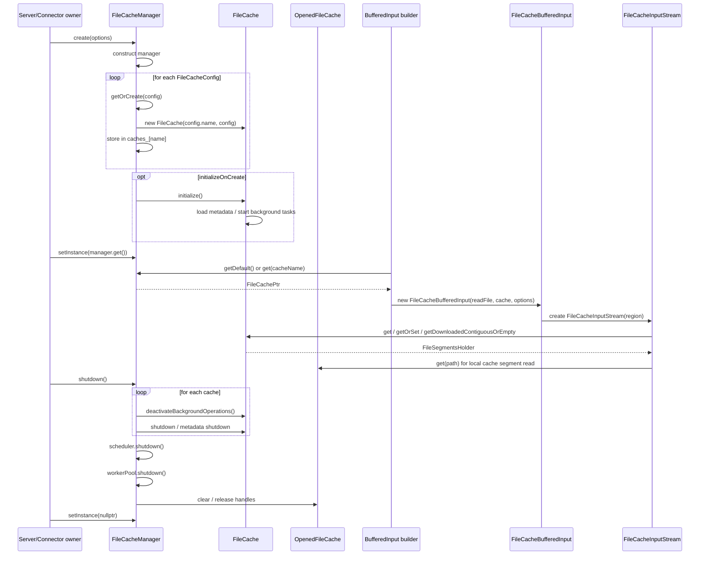

# `FileCacheManager` 生命周期设计

这个设计参考 Velox `AsyncDataCache` 的生命周期模式，但不复用
`AsyncDataCache` 的缓存算法。

## 参考的 `AsyncDataCache` 模式

Velox `AsyncDataCache` 有几个值得复用的生命周期约定：

```text
AsyncDataCache::create(...)
  -> 构造 shared_ptr
  -> 注册到 allocator

AsyncDataCache::getInstance / setInstance
  -> process 级全局裸指针入口

AsyncDataCache::shutdown
  -> 主动释放后台/外部资源

refreshStats / toString
  -> 提供 stats snapshot 和 debug 输出
```

`FileCache` 迁移后可以参考这些入口，但不要继承 `memory::Cache`，因为 ClickHouse
`FileCache` 是本地磁盘 file segment cache，不是 Velox 内存页 cache。

## 总体职责

`FileCacheManager` 负责：

- 按 `FileCacheConfig` 创建并持有 `FileCache` 实例。
- 管理默认 cache 和按 name/path 区分的多个 cache。
- 触发 `FileCache::initialize` / metadata load。
- 触发 shutdown，停止后台任务和下载线程。
- 持有 `OpenedFileCache` 实例，用于本地 cache segment 的 read handle cache。
- 持有所有 cache 共享的 `FileCacheScheduler` 和 physical `FileCacheWorkerPool`。
- 向所有 cache 注入稳定的 common user id、local filesystem 和 memory pool。
- 为 `FileCacheBufferedInput` 提供 `FileCachePtr`。
- 提供 stats/debug 输出入口。

`FileCache` 自身的算法和数据结构仍直接参考 ClickHouse，不在 manager 中重写。

## 接口设计

```cpp
class FileCacheManager
{
public:
    struct NamedFileCacheConfig
    {
        std::string name;
        FileCacheConfig config;
        std::string configPath;
    };

    struct Options
    {
        std::vector<NamedFileCacheConfig> caches;
        std::string defaultCacheName;
        std::string commonUserId;
        std::string cachePathPrefix;
        std::string allowedCacheRoot;
        std::shared_ptr<filesystems::FileSystem> localFileSystem;
        memory::MemoryPool * memoryPool = nullptr;
        std::shared_ptr<folly::Timekeeper> timekeeper;
        bool initializeOnCreate = true;
    };

    static std::shared_ptr<FileCacheManager> create(Options options);

    static FileCacheManager * getInstance();
    static void setInstance(FileCacheManager * manager);
    static FileCacheManager & instance();

    FileCachePtr get(const std::string & name) const;
    FileCachePtr getDefault() const;

    FileCacheFactory & factory();
    const FileCacheFactory & factory() const;

    OpenedFileCache & openedFileCache();

    void initialize();
    void shutdown();

    FileCacheManagerStats refreshStats() const;
    std::string toString(bool details = true) const;

private:
    explicit FileCacheManager(Options options);

    mutable std::mutex mutex_;
    std::string commonUserId_;
    FileCacheWorkerPool workerPool_;
    FileCacheScheduler scheduler_;
    OpenedFileCache openedFileCache_;
    FileCacheFactory factory_;
    std::string defaultCacheName_;
    bool shutdown_ = false;
};

```

资源字段必须声明在 `factory_` 之前，使 C++ 逆序析构时先销毁 Factory/caches，再销毁
opened handles / scheduler / worker pool。

`commonUserId` 必须 non-empty、跨复用同一 cache path 的进程重启保持稳定，且不能为保留
值 `"internal"`。

## 与 `AsyncDataCache` 的对应关系

| `AsyncDataCache` | `FileCacheManager` |
|---|---|
| `AsyncDataCache::create` | `FileCacheManager::create` |
| `AsyncDataCache::getInstance` / `setInstance` | `FileCacheManager::getInstance` / `setInstance` |
| `AsyncDataCache::shutdown` | `FileCacheManager::shutdown` |
| `AsyncDataCache::refreshStats` | `FileCacheManager::refreshStats` |
| `AsyncDataCache::toString` | `FileCacheManager::toString` |
| `AsyncDataCache` shards | 不对应；`FileCache` 自己管理 metadata/priority/sharding |
| `memory::Cache` registration | 不对应；`FileCache` 不是 memory cache |

## 创建流程

```text
FileCacheManager::create(options)
  -> manager = make_shared<FileCacheManager>(options)
  -> for each NamedFileCacheConfig:
         manager->factory().getOrCreate(name, config, configPath)
  -> if initializeOnCreate:
         manager->initialize()
  -> return manager
```

`getOrCreate`：

```text
lock mutex
if cache name exists:
    return existing
create FileCache(config.name, config)
store in caches_
return cache
```

是否允许同名不同 config 需要明确：建议第一版直接报错，避免 silently 复用错误实例。

## 生命周期序列图



## 全局实例

参考 `AsyncDataCache`，提供：

```cpp
static FileCacheManager * getInstance();
static void setInstance(FileCacheManager * manager);
```

用途：

- 测试/工具可以设置默认 manager。
- scan 创建 `FileCacheBufferedInput` 时可以从 manager 获取默认 cache。
- 长期更推荐显式注入 `FileCacheManager*`，全局 instance 只作为兼容入口。

全局 instance 不拥有生命周期；拥有者仍是外部 `shared_ptr<FileCacheManager>`。

## shutdown

`shutdown` 必须显式调用，负责：

```text
for each FileCache:
    cache->deactivateBackgroundOperations()
    cache->shutdown / metadata shutdown（按迁移后的 FileCache 接口命名）
scheduler.shutdown()
workerPool.shutdown()
clear openedFileCache
mark shutdown_
```

如果 `FileCache` 析构也能兜底 shutdown，仍建议保留显式 `shutdown`，和
`AsyncDataCache` 风格一致。

## `OpenedFileCache` 生命周期

`OpenedFileCache` 不复用 Hive connector 的 `fileHandleFactory_`，而是由
`FileCacheManager` 单独持有：

```cpp
class FileCacheManager
{
    OpenedFileCache openedFileCache_;
};
```

原因：

- Hive connector 的 `FileHandleCache` 是 connector 级共享，用于 source files。
- `FileCache` 本地 segment 文件有自己的生命周期。
- 删除 cache segment 时必须 invalidate 对应本地 handle。

调用关系：

```text
FileCacheInputStream::getCacheReadBuffer
  -> manager.openedFileCache().get(path)
  -> ReadBufferFromVeloxReadFile(handle.file)

FileCache metadata remove segment
  -> manager.openedFileCache().remove(path)
```

如果 Velox `FileHandleFactory` 没有单 key remove，`OpenedFileCache` 可以是一个薄
wrapper：内部用 `FileHandleFactory` 创建 handle，同时维护 path -> handle 的删除能力。

## 与 `FileCacheBufferedInput` 的关系

`FileCacheBufferedInput` 不应该自己创建 `FileCache`。它接收已经解析好的：

```cpp
FileCachePtr cache;
FileCacheReadOptions readOptions;
FileCacheRequestContext requestContext;
```

创建位置：

```text
scan setup / BufferedInput builder
  -> manager.getDefault() 或 manager.get(cacheName)
  -> FileCacheBufferedInput(readFile, cache, ...)
```

这样读路径不需要解析配置，也不会在 hot path 创建 cache。

## 多 cache 支持

ClickHouse 支持多个 file cache 配置。Velox 侧也保留：

```text
file-cache.<name>.path
file-cache.<name>.max-size
...
```

`FileCacheManager` 用 name 管理多个实例。

第一版可以只启用 default cache，但接口保留多 cache 能力。

## shared worker pool 容量

每个 cache 的 conservative max worker budget：

```text
cacheWorkerMax =
  loadMetadataThreads
  + (loadMetadataAsynchronously ? 1 : 0) async main worker
  + backgroundDownloadThreads
  + 1 metadata cleanup worker
  + 1 background cleanup callback
  + (freeSpaceKeepingEnabled
      ? 1 free-space collector callback + keepFreeSpaceEvictionThreads
      : 0)
```

manager 创建 shared pool 时：

```text
workerPoolMax = sum(cacheWorkerMax for every unique FileCache instance)
workerPoolMin = 1
```

`folly::CPUThreadPoolExecutor` 使用 dynamic mode：只在有 pending task 时按需增长到 max，
idle worker 超时后回落到 min。因此 conservative max 不会在启动时预创建全部 threads。

动态新增 cache 或增加 `backgroundDownloadThreads` 时，先通过 `setNumThreads` 扩 max，
再创建 worker。cache shutdown/remove 后才通过 `setNumThreads` 缩 max。

同 path + 同 config 的多个名字复用一个 `FileCache`，只计一次 budget。

每个 cache 自己的 free-space `eviction_pool` 是 logical `FileCacheThreadPool`；它没有
独立 executor，physical workers 仍来自 manager pool。因此
`keepFreeSpaceEvictionThreads` 已计入 `cacheWorkerMax`。

## config reload / dynamic resize

宿主如何监听/刷新配置不作强制要求，但 `FileCache` 已支持的 runtime apply行为必须迁移：

```cpp
void applyConfig(const FileCacheConfig & newConfig);
```

内部应调用迁移后的：

```text
FileCache::applySettingsIfPossible
```

动态 resize 仍由 `FileCache` 自身处理，manager 只负责把新配置传进去。

## stats

建议先定义简单 stats：

```cpp
struct FileCacheManagerStats
{
    std::unordered_map<std::string, FileCacheStats> caches;
    FileHandleCacheStats openedFileCacheStats;
};
```

`FileCacheStats` 可以先只包含：

- initialized
- current size
- current elements
- max size
- max elements
- hit/miss/write/eviction counters

更详细的指标后续再对接 Velox runtime stats / metrics。

逐文件最终设计详见
[`23-filecache-manager-files-design.md`](23-filecache-manager-files-design.md)。

## 最小落地步骤

1. 添加 `FileCacheManager` 空壳，支持 `create` / `getInstance` / `setInstance`。
2. 支持单 default cache 的 `getDefault`。
3. 接入 `FileCacheConfig` 创建 `FileCache`。
4. 持有独立 `OpenedFileCache`。
5. 让 `FileCacheBufferedInput` 构造方从 manager 获取 `FileCachePtr`。
6. 添加 `shutdown`，清理 cache 后台任务和 opened file handles。
7. 添加基础 stats / `toString`。
