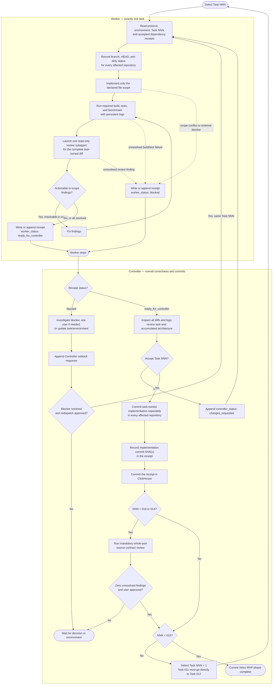

# `FileCache` Port Task Execution Protocol

This protocol coordinates one worker agent and one controller through files.
The worker implements exactly one numbered task and stops. The controller owns
cross-task correctness, acceptance, and commits.

## Current execution boundary

```text
Current state:        Task 018R is accepted. Task 017B implementation is authorized.
                       ClickHouse Task-018R plan head: 6b9bce64041
                       (receipt accepted in the current acceptance commit).
                       Velox head: 0c5b5918eb (filecache; Task-018R reverse).
                       Gluten head: c44409a7c3
                       (local fix/vcpkg-arrow-squashed; vcpkg Arrow codec fix;
                       do not push by user decision).
                       Verdict file:
                         port/task/fullreview/root-oss/5/003-018-whole-port-review.md
                       task_017b_authorized: true
                       implementation_authorized: true (Controller authorized 2026-07-24)
                       plan_review_receipt:
                         port/task/fullreview/root-oss/5/017b-implementation-plan-review.md
Pipeline order:        Task 017A -> Task 018 -> four-driver addendum ->
                       Review 5 [ACCEPTED] -> Task 018R [ACCEPTED] ->
                       Task 017B -> Task 019
                       Gluten/Spark integration.
Non-blocking debt:    `R2-D4` and `R2-D6` remain pending; their six rows remain
                       UNPROVEN in the 215-row denominator by user decision.
                       These are non-blocking forward debt and do not gate 017B.
Immediate next action:
                       Dispatch a fresh Task 017B Worker to implement
                       port/task/017b-filecache-logging-exception-stack-plan.md
                       (reviewed_executable, all findings resolved).
                       Worker must not commit; result receipt expected at
                       port/task/result/017b-filecache-logging-exception-stack-result.md
                       with worker_status: ready_for_controller.
                       Task 019 remains blocked on Task 017B acceptance.
Task 015 is complete.
Task 016's rewritten contract is deferred by user decision because Velox has no
temporary-data spill consumer and it is not a mainline feature.
Task 017A owns statistics/cancellation/scheduler/caller-id. Task 018 is
Velox-only and owns correctness, core/buffered-input/wrapper microbenchmarks,
safe orchestration, and TPCH. Task 017A and Task 018 non-TPCH work are accepted;
018-P is approved, so 018-C may run before gated 018-H2.
Task 017B independently owns logging and exception stacks. It executes after
the now-accepted Task 018 four-driver addendum and Review 5, and must be
accepted before Task 019.
Task 018 has an additional mandatory stop after all non-TPCH work and before any
TPCH source copy/build/run. Benchmark evidence must come from RelWithDebInfo or
Release, never Debug. TPCH resumes only after explicit user approval.
Tasks 011-015 have been amended with dependency pre-checks, consumer-contract
  excerpts, structure-deviation registrations, RED matrices, false-green
  probe requirements, exact CH/Velox source citations, exact test owners,
  and explicit stop conditions.
Deferred Velox work:  Task 016
Planned Velox work:   `017a-filecache-statistics-cancellation-plan.md` [DONE],
                      then Task 017B from the reviewed executable plan at
                      port/task/017b-filecache-logging-exception-stack-plan.md
Planned Gluten work:  `019-filecache-gluten-integration-spark-e2e-plan.md`
Deferred Gluten:      Task 019, blocked on Task 017B acceptance
```

Task 011 and Task 012 form one atomic SCC migration stage. Run them
consecutively, but still use separate workers and receipts. Task 011 is
intentionally not a green build gate; Task 012 must restore the compile/link
closure.

## Source-of-truth files

For task `NNN`, the worker reads:

```text
port/task/EXECUTION_PROTOCOL.md
port/task/ENVIRONMENT.md
port/task/NNN-*.md
port/task/result/*-result.md for earlier accepted dependencies
every CH production source file and real caller listed by Task NNN
```

Authority order for behavior:

```text
current user decision
CH production source + real FileCache callers
approved port design contract
numbered task and its amendments
implementation and tests
accepted receipts
```

The numbered task defines scope, commands, acceptance criteria, and the receipt filename, but it
cannot silently weaken a higher-authority behavior contract. If sources, design, task, tests, or
existing implementation disagree, stop and record the conflict rather than guessing.

## Unreviewed dependency gate

During migration, “dependency” includes every CH external class, base class, macro,
type alias, helper, API, lifecycle primitive, no-op/debug hook, and every proposed
Velox replacement or fallback.

Before using or replacing one, the Worker and Controller must find an explicit
reviewed mapping in an approved design or the current task amendment. A name-only
row, an implementation guess, an existing compiled shim, or a previously accepted
receipt is not sufficient when behavior has not been reviewed.

If no explicit reviewed contract exists:

1. stop all implementation work for the current task;
2. do not start or continue any later task, even if it appears independent;
3. append `worker_status: blocked` with:
   - CH defining source and real callers;
   - required API/state/error/ownership/concurrency behavior;
   - candidate Velox primitives and known semantic differences;
   - the exact decision needed from the user;
4. the Controller appends `controller_status: waiting_for_user`;
5. ask the user to review the dependency mapping;
6. only after the user approves, write the decision into the canonical design and
   numbered task amendment;
7. redispatch the same task from the source-contract check.

The agent must not choose a “closest” Velox API, create a compatibility shim, mark
the dependency no-op/deferred, or add a fallback before this review gate is closed.

## State machine

```text
not_started
  -> worker_running
  -> ready_for_controller
  -> accepted

accepted
  -> reopened_by_contract_audit
  -> worker_running

ready_for_controller
  -> changes_requested
  -> worker_running

worker_running
  -> blocked
  -> worker_running

worker_running
  -> waiting_for_pre_tpch_approval
  -> worker_running
```

Only the worker writes implementation changes and worker-attempt sections.
Only the controller writes controller-review/audit sections and creates commits.
Existing receipt sections are immutable, but an accepted task can be reopened by appending a
post-acceptance contract-audit section. Never erase the original acceptance or rewrite history.
A `blocked` receipt is escalated to the controller. After the external blocker
is resolved, the controller redispatches the same task number for a new worker
attempt.

## Worker rules

1. Execute exactly one task number. Do not begin its recommended next task.
2. Do not stage, commit, amend, rebase, push, or create a pull request.
3. Before editing, capture branch, HEAD, and dirty status in every repository
   named by the task. Preserve unrelated existing changes.
4. Modify only the task's declared file scope. If another file is required,
   stop as `blocked` and explain why instead of silently expanding scope.
5. Before implementation, enumerate every CH dependency reached by the task and verify each
   has an explicit approved mapping. An unreviewed dependency triggers the gate above.
6. Before implementation, derive a contract table from the listed CH source and real call sites:
   API/signature, state transition, error behavior, ownership/lifetime, concurrency, persistence,
   and allowed Velox substitution. If the task contradicts that table, stop as `blocked`.
7. Follow the task steps and run every applicable acceptance gate. Redirect
   build and test output to the exact log files required by the task.
8. A skipped, disabled, unbuilt, unregistered, comment-only, or assertion-free test is not a passing test.
   Do not weaken assertions or acceptance criteria to obtain green output.
9. Every material contract requires a real RED test that fails against the pre-change implementation
   for the expected behavioral reason. A compile failure caused only by a missing new header does not
   prove runtime semantics.
10. After implementation and local validation, launch exactly one read-only
   code-review subagent for the complete task-owned diff across all affected
   repositories. Give it the task file, relevant design references, complete
   diffs, and test outcomes. Ask only for correctness, concurrency, lifetime,
   integration, and false-green findings; it must not edit files.
11. Resolve every actionable in-scope review finding and rerun affected gates.
   Record findings and resolutions. Unresolved findings make the task
   `blocked`, not successful.
12. Write or append the task's declared result receipt. Set
   `worker_status: ready_for_controller` when complete,
   `worker_status: blocked` when unresolved, or
   `worker_status: waiting_for_pre_tpch_approval` at Task 018's mandatory
   checkpoint, then stop immediately.

The worker is responsible for correctness inside the assigned task. It is not
responsible for approving the overall port architecture or earlier tasks.

## Worker receipt format

The task file's result path is authoritative. Create the parent directory if
needed. Use one `Worker attempt` section per attempt; never erase prior
controller feedback.

````markdown
# Task NNN Result: <title>

## Worker attempt 1

```text
worker_status: ready_for_controller | blocked | waiting_for_pre_tpch_approval
environment_profile: <name>
task: NNN
```

## Repository baselines

| Repository | Branch | HEAD | Initial dirty status |
|---|---|---|---|
| `<path>` | `<branch>` | `<sha>` | `<status>` |

## Files changed

```text
<absolute or repository-relative paths>
```

## Commands and outcomes

| Command purpose | Exit code | Log |
|---|---:|---|
| configure/build/test/benchmark | 0 | `<absolute log path>` |

## Acceptance evidence

```text
test count:
failed tests:
skipped/disabled tests:
benchmark result, when required:
git diff --check:
```

## Worker review

```text
review subagent:
findings:
resolutions:
unresolved findings:
```

## Blockers

```text
None, or the first actionable error and exact evidence.
```

## Worker declaration

```text
Only Task NNN was attempted.
Changes are unstaged and uncommitted.
The worker stopped after writing this receipt.
```
````

For a rework attempt, append `## Worker attempt 2` with fresh baselines,
commands, evidence, and review. Do not alter the previous attempt or the
controller's request.

## Task-018 pre-TPCH checkpoint

When the Task-018 Worker writes
`worker_status: waiting_for_pre_tpch_approval`, the Controller:

1. verifies every non-TPCH correctness, micro, wrapper, orchestration, and
   Waves 1–3 gate;
2. verifies every benchmark binary came from a fresh RelWithDebInfo or Release
   build;
3. verifies `tpch_sources_copied`, `tpch_target_built`, and
   `tpch_commands_run` are all `false`;
4. appends a Controller checkpoint review to the receipt;
5. stops and waits for explicit user approval without accepting Task 018 or
   dispatching Review 5.

After approval, the Controller records it in the receipt and dispatches a fresh
Task-018 Worker. The new Worker appends the next Worker-attempt section, executes
018-C/018-H2 only, and then returns the complete task to the normal
`ready_for_controller` acceptance path.

## Blocked handoff

When a worker cannot finish within the declared scope, it writes a normal
worker-attempt section with `worker_status: blocked`, includes the first
actionable error or decision needed, and stops. The controller investigates
without asking the stopped worker to remain active.

The controller appends:

````markdown
## Controller unblock response 1

```text
controller_status: blocker_resolved | waiting_for_user | waiting_for_environment
task: NNN
```

## Resolution

```text
root cause:
decision:
task or environment update:
evidence:
redispatch same task: yes | no
```
````

If a product or architecture decision is required, the controller asks the
user and records the answer here. If the task file or environment changes, the
controller records the exact change. Only `blocker_resolved` with
`redispatch same task: yes` starts another worker attempt.

## Controller rules

The controller performs these checks after the worker stops:

1. Confirm the receipt says `ready_for_controller`, names the requested task,
   and contains no unresolved finding or blocker.
2. Inspect branch, HEAD, status, and complete diffs in every affected
   repository. Separate task-owned changes from pre-existing user changes.
3. Enumerate the task's external dependencies and confirm each has an explicit user-reviewed
   mapping. If any dependency is unreviewed, set `waiting_for_user` and stop the pipeline.
4. Re-derive the contract independently from CH production source and real callers; do not treat
   the task, its tests, or a prior receipt as the behavioral source of truth.
5. Check exact file scope, API compatibility, dependency direction, ownership,
   concurrency, shutdown order, error propagation, and consistency with all
   previously accepted tasks.
6. Read the referenced logs and verify commands, exit codes, test discovery,
   test counts, and benchmark evidence. Rerun a focused gate when evidence is
   incomplete or suspicious.
7. Reject false-green evidence: comment-only test bodies, null fixtures, assertions unrelated to
   the promised behavior, tests that never reached the changed path, and tests that cannot fail when
   the implementation is removed.
8. Perform the overall architecture review that the worker intentionally does
   not own. In particular, check that the accumulated implementation still
   matches the dependency DAG and accepted design documents.
9. Append one controller-review section to the receipt.
10. If changes are required, set `controller_status: changes_requested`, do not
   stage or commit, and dispatch the same task number again.
11. If accepted, commit task-owned implementation separately in every affected
   implementation repository, then commit the receipt in the ClickHouse
   repository. Never include unrelated changes.

## Whole-port review gates

### After Task 010

After Task 010 is accepted and all affected repositories are clean:

1. Dispatch no Task 011 Worker.
2. Review the accumulated Tasks 003-010 contracts against CH source, real callers,
   approved designs, implementation, tests, failure paths, and cross-task dependencies.
3. If any finding exists, append a post-acceptance audit to the affected receipt/task,
   set it to `reopened_by_contract_audit`, and stop.
4. Continue to Task 011 only when there are zero unresolved findings and the user
   explicitly approves.

### After Task 014

After Task 014 is accepted and all affected repositories are clean:

1. Dispatch no Task 015 Worker.
2. Review the accumulated Tasks 003-014, including the center SCC, Factory/Manager,
   remote reader handoff, cache miss/hit, seek, exception cleanup, and shutdown.
3. If any finding exists, reopen the affected task and stop.
4. Continue to Task 015 only when there are zero unresolved findings and the user
   explicitly approves.

Every physical commit for one logical task starts its subject with
`Task NNN:`. A cross-repository task therefore has multiple commits linked by
the same task number. Do not amend or rebase. Do not commit on `master`.

## Controller receipt format

Append:

````markdown
## Controller review 1

```text
controller_status: accepted | changes_requested
environment_profile: <name>
task: NNN
```

## Review evidence

```text
scope review:
implementation review:
cross-task architecture review:
log and test review:
unresolved findings:
```

## Required changes

```text
None, or precise actionable findings for the next worker attempt.
```

## Commits

| Repository | Commit |
|---|---|
| `<path>` | `<sha>` |

````

For `changes_requested`, leave the commit table empty. For `accepted`, append
the implementation commit IDs before committing the receipt itself. The
ClickHouse receipt commit cannot list its own SHA; identify it in the
controller's external task ledger or next accepted receipt if needed.

## Copyable worker prompt

Before dispatching: select the active profile from `port/task/ENVIRONMENT.md`
and resolve all logical keys (e.g. `<clickhouse_repo>`, `<velox_repo>`,
`<ninja>`) to their concrete values. Then replace only `NNN`:
```text
Execute FileCache port Task NNN using file-only coordination.

Repository containing the task protocol:
<clickhouse_repo>

You must first read:
- port/task/EXECUTION_PROTOCOL.md
- port/task/ENVIRONMENT.md
- the single file matching port/task/NNN-*.md
- accepted prerequisite receipts under port/task/result/

Execute exactly Task NNN. Follow its declared scope and gates. Do not start
another task. Do not stage, commit, amend, rebase, push, or create a PR.
Preserve unrelated dirty changes.

After implementation and validation, launch exactly one read-only code-review
subagent for the complete Task NNN diff. Fix all actionable in-scope findings
and rerun affected gates. Then write or append the result receipt required by
the task, using the format and state machine in EXECUTION_PROTOCOL.md. Stop
immediately after the receipt is written, whether the task is ready or blocked.

Your final response must contain only:
Task NNN stopped; receipt: <absolute path>; worker_status: <status>
```

## Copyable controller prompt

Replace only `NNN`:

```text
Review FileCache port Task NNN as controller.

Read port/task/EXECUTION_PROTOCOL.md, port/task/ENVIRONMENT.md, the Task NNN
file, its result receipt, and accepted dependency receipts. Inspect the full
task-owned diff and referenced logs in every affected repository. Review both
task correctness and accumulated architecture correctness.

Append a controller review to the receipt. If changes are needed, set
controller_status to changes_requested, do not stage or commit, and stop. If
accepted, commit only task-owned implementation changes separately in each
affected implementation repository with a `Task NNN:` subject, record those
SHAs in the receipt, and then commit only the receipt in the ClickHouse
repository. Never amend, rebase, or commit on master.
```

## End-to-end workflow


